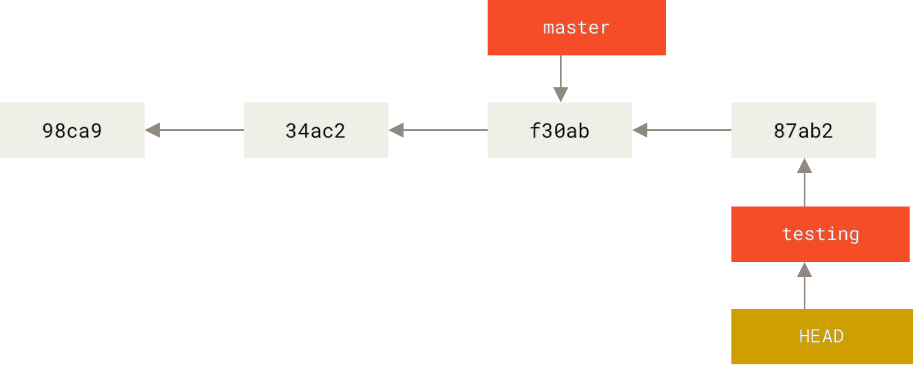

# Git Commands

# Getting started

Refer to the following book for learning more about git  
https://git-scm.com/book/en/v2/Git-Basics-Getting-a-Git-Repository

`git clone https://github.com/calebljl/CODE_EXP_project1.git`

# Stage, commit, push

set username and email to be recorded in metadata of commits  
`git config --global user.name caleb`
`git config --global user.email caleb@example.com`

`git status`  
check what status files are currently in

1. Local working directory (unmodified / modified)
2. Staging area
3. Commit area
4. Remote repo

`git add .`  
working -> staging  
for all files

git add <file_name>  
`git add App.js`  
for specific files

git restore --staged <file_name>  
`git restore --staged App.js`  
remove from staging area, back to working directory  
\*IMPT: `git restore` without staged tag will DELETE current changes in working directory

`git commit -m "my commit message"`  
staging -> commit

`git commit -a -m "my commit message"`  
stage all files & commit in one command

git push <remote_name> <branch_name>  
`git push origin main`  
commit -> remote

- remote repo is almost always called origin
- if branch not specified, will git push to the current branch
- first branch is called main

`git remote show origin`
show status of remotes

# Branching

`git branch`
view all branches

- `git branch -v` see most recent commit
- `git branch --merged` see which branches already merged into the CURRENT branch you're on

git branch <new_branch_name>  
`git branch testing`  
create a new branch

`git switch testing`  
switch to that branch  
alternative: `git checkout testing` but `switch` is recommended  
must commit / stash all changes before you're allowed to switch to diff branch

`git checkout -b testing`  
to create new branch and switch to it at the same time

`git log --oneline --decorate --graph --all`  
graph of branching  
type `wq` to exit graph

`git merge hotfix`
simple "fast-foward" merge back into main branch

- \*IMPT: BEFORE RUNNING THIS COMMAND, need to `git switch main` to return to main branch first
- resolve merge conflicts in VSC: either accept current, accept incoming, both, or edit the code again to compromise between the two
- AFTER RESOLVING CONFLICTS: `git commit -m "merge conflict resolved"` and to finish the merge

`git branch -d hotfix`
delete branch if no longer needed
